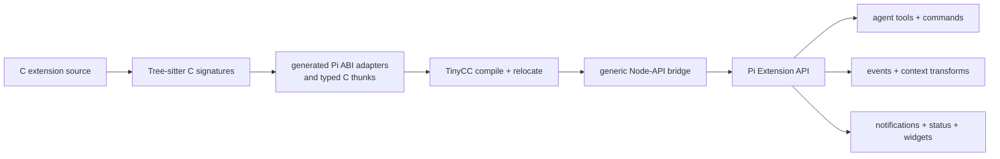
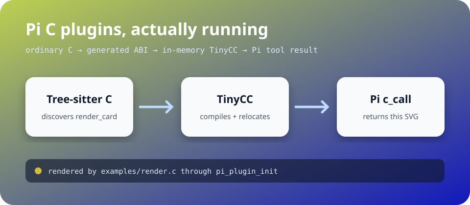

# pi-cplugins

<!-- README.md is generated from README.qmd. Its pi and node cells execute through knitr. -->

[](https://github.com/sounkou-bioinfo/pi-cplugins/actions/workflows/ci.yml)
[](LICENSE)
[](package.json)

`pi-cplugins` makes C an implementation language for Pi extensions. A C
file can register agent tools, slash commands, event hooks, context
transforms, and TUI effects from `pi_plugin_init`. The same compiler
path can also discover ordinary C functions and expose them to an agent
or to TypeScript.

The important idea is simple:



Tree-sitter metadata produces signature-specific C thunks that TinyCC
compiles with the source. TinyCC applies the platform C calling
convention for integer promotion, struct layout, alignment, variadic
calls, and callback signatures.

## Install

Install the package directly from GitHub, then start Pi:

``` sh
pi install git:github.com/sounkou-bioinfo/pi-cplugins
pi
```

## A C extension that turns zlib into an agent tool

The following block is rendered by a real non-interactive Pi agent. The
agent loads [`examples/zlib_extension.c`](examples/zlib_extension.c)
with `libz`. Its `pi_plugin_init` registers `c_zlib_crc32`,
`/c-zlib-version`, and a `tool_result` hook. The tool calls zlib from C,
streams an update, and sets a notification, footer status, and widget
before the agent reports the linked version:

``` sh
'pi' --provider 'openai-codex' --model 'gpt-5.4' --no-extensions --thinking 'medium' -e './extension/index.ts' --no-session -p \
  "$(printf %s \
    'Load examples/zlib_extension.c with library z, call ' \
    'c_zlib_crc32 for Pi extension ABI, and reply with only ' \
    'the zlib version returned by C.')"
```

> 1.3.1

## Let an agent call ordinary C

[`examples/ffi.c`](examples/ffi.c) exports mutable arrays, by-value
structs, and callbacks. [`examples/render.c`](examples/render.c) returns
an SVG from C. This cell gives both files to Pi:

``` sh
'pi' --provider 'openai-codex' --model 'gpt-5.4' --no-extensions --thinking 'medium' -e './extension/index.ts' --no-session -p \
  "$(printf %s \
    'Load examples/ffi.c as ffi and examples/render.c as ' \
    'render. Reverse [1,2,3,4], render a card with accent ' \
    '188, list the modules, then unload them. Report the C ' \
    'results.')"
```

> Loaded: - `examples/ffi.c` → `ffi` - `examples/render.c` → `render`
>
> C results: - `ffi.reverse4([1,2,3,4])` → `[4,3,2,1]` -
> `render.render_card(188)` → SVG string rendered successfully
>
> Modules before unload: - `ffi`: `scale_f64`, `reverse4`,
> `uppercase_ascii`, `sum_bytes`, `point_norm_squared`, `make_point`,
> `point_value_norm_squared`, `make_number_bits`, `number_bits_real`,
> `reverse_direction`, `apply_i32` - `render`: `render_width`,
> `render_height`, `render_card`
>
> Rendered SVG:
>
> ``` svg
> <svg xmlns="http://www.w3.org/2000/svg" width="960" height="420" viewBox="0 0 960 420"><defs><linearGradient id="bg" x1="0" y1="0" x2="1" y2="1"><stop stop-color="rgb(188,208,80)"/><stop offset="1" stop-color="rgb(18,24,188)"/></linearGradient><filter id="shadow"><feDropShadow dx="0" dy="8" stdDeviation="10" flood-opacity=".28"/></filter></defs><rect width="960" height="420" rx="28" fill="url(#bg)"/><text x="52" y="72" fill="white" font-family="system-ui,sans-serif" font-size="34" font-weight="700">Pi C plugins, actually running</text><text x="52" y="108" fill="#dbeafe" font-family="ui-monospace,monospace" font-size="16">ordinary C → generated ABI → in-memory TinyCC → Pi tool result</text><g filter="url(#shadow)" font-family="system-ui,sans-serif" text-anchor="middle"><rect x="52" y="158" width="220" height="122" rx="18" fill="#f8fafc"/><text x="162" y="211" fill="#0f172a" font-size="22" font-weight="700">Tree-sitter C</text><text x="162" y="244" fill="#475569" font-size="15">discovers render_card</text><rect x="370" y="158" width="220" height="122" rx="18" fill="#f8fafc"/><text x="480" y="211" fill="#0f172a" font-size="22" font-weight="700">TinyCC</text><text x="480" y="244" fill="#475569" font-size="15">compiles + relocates</text><rect x="688" y="158" width="220" height="122" rx="18" fill="#f8fafc"/><text x="798" y="211" fill="#0f172a" font-size="22" font-weight="700">Pi c_call</text><text x="798" y="244" fill="#475569" font-size="15">returns this SVG</text></g><g stroke="#bfdbfe" stroke-width="5" fill="none" stroke-linecap="round"><path d="M286 219h65"/><path d="m340 208 11 11-11 11"/><path d="M604 219h65"/><path d="m658 208 11 11-11 11"/></g><rect x="52" y="326" width="856" height="48" rx="12" fill="rgba(15,23,42,.62)"/><circle cx="78" cy="350" r="7" fill="rgb(208,188,62)"/><text x="98" y="356" fill="#e2e8f0" font-family="ui-monospace,monospace" font-size="15">rendered by examples/render.c through pi_plugin_init</text></svg>
> ```
>
> Unloaded: - `ffi` - `render`



The extension contributes five agent tools:

| Tool | Meaning |
|----|----|
| `c_extension_load` | Compile C that registers Pi tools, commands, hooks, and TUI effects |
| `c_load` | Parse, generate, compile, relocate, and retain a C module |
| `c_call` | Call one generated binding and report its result and mutations |
| `c_modules` | Inspect loaded modules, functions, C extensions, and registrations |
| `c_unload` | Close plugin state before releasing relocated TinyCC code |

Run `/c-modules` to display the same module and extension state
directly.

## Author the Pi extension in C

[`include/pi_plugin.h`](include/pi_plugin.h) exposes Pi registration and
runtime operations directly. A C extension registers behavior from
`pi_plugin_init`; the TypeScript layer is one generic bridge that copies
descriptors into `pi.registerTool`, `pi.registerCommand`, and `pi.on`.

The central code in the complete zlib extension is ordinary C:

``` c
#include "pi_plugin.h"
#include <zlib.h>

static int32_t checksum_tool(
    void *data,
    const pi_plugin_callback_context *ctx,
    const char *input_json,
    size_t input_size,
    const char **output_json,
    size_t *output_size) {
  /* The full example validates and extracts the bounded text field. */
  state.checksum = crc32(0L, (const Bytef *)text, (uInt)text_size);
  state.host.tool_update(state.host.host_data, ctx->host_call_data,
                         update, sizeof(update) - 1u);
  state.host.ui_set_status(state.host.host_data, ctx->host_call_data,
                           "c-zlib", 6u, "CRC32 ready", 11u);
  return write_checksum_result(&state, 0, output_json, output_size);
}

pi_plugin_api *pi_plugin_init(const pi_plugin_host_api *host) {
  pi_plugin_copy_host_api(&state.host, host);
  state.api.close = close_extension;

  static const pi_plugin_tool tool = {
    .name = "c_zlib_crc32",
    .parameters_json = checksum_schema,
    .execute = checksum_tool,
    .callback_data = &state,
  };
  static const pi_plugin_command command = {
    .name = "c-zlib-version",
    .execute = version_command,
    .callback_data = &state,
  };
  static const pi_plugin_event_handler result_hook = {
    .event_name = "tool_result",
    .execute = verify_result,
    .callback_data = &state,
  };

  host->register_tool(host->host_data, &tool);
  host->register_command(host->host_data, &command);
  host->on(host->host_data, &result_hook);
  return &state.api;
}
```

The callback receives the Pi working directory, cancellation polling,
streaming tool updates, notifications, footer status, and widgets
through the host table. Its input is bounded JSON for the registered
tool, command, or event. Its output is the corresponding Pi result: tool
content, a `before_agent_start` system prompt transform, a `context`
message transform, a `tool_call` block, or a `tool_result` replacement.
Each handler carries Pi’s event name as a string, so the registration
function can carry new hooks while public structs grow through reserved
slots.

[`examples/zlib_extension.c`](examples/zlib_extension.c) is the full
source, including bounded input validation, cancellation, JSON results,
cleanup, the slash command, and the result hook. Ask Pi to load it with
`library: "z"`; the evaluated agent cell above does exactly that. The
separate [`examples/pi_extension.c`](examples/pi_extension.c)
conformance example also registers `before_agent_start` and `context`
transforms.

## What happens when Pi loads ordinary functions

Tree-sitter C reads each ordinary non-static function definition and
preserves its actual parameter and return shape. From that metadata,
`pi-cplugins` generates two pieces of C in the same compilation unit as
the source: the stable `pi_plugin.h` adapter used by Pi, and a
signature-specific typed thunk used by the Node binding.

TinyCC compiles and relocates the source and both generated layers
together. A call such as `make_point(3, 4)` is therefore a real C call
returning `struct point` by value. TinyCC chooses the platform calling
convention and layout. The JavaScript receives the resulting bytes
together with TinyCC-generated layout metadata.

The TinyCC state remains alive for the lifetime of the loaded module.
Closing the module first closes plugin state and only then calls
`tcc_delete`, so neither a function nor a callback trampoline can point
into released code.

## Use the same compiler directly from TypeScript

The package-level `cc()` API exposes the same Tree-sitter and TinyCC
path directly to TypeScript:

``` javascript
const assert = await import("node:assert/strict");
const { cc } = await import("pi-cplugins");

const compiled = await cc({ source: "examples/ffi.c" });

const values = new Float64Array([1.5, 2.5, 4]);
compiled.symbols.scale_f64(values, values.length, 2);

const point = compiled.symbols.make_point(3, 4);
const pointLayout = compiled.layout("struct:point");
const pointNormSquared = compiled.symbols.point_value_norm_squared(point);
const callbackAnswer = compiled.symbols.apply_i32(
  14,
  (value) => Number(value) * 3,
);

assert.deepEqual([...values], [3, 5, 8]);
assert.deepEqual(pointLayout, { size: 16, alignment: 8 });
assert.equal(pointNormSquared, 25);
assert.equal(callbackAnswer, 42);
console.log(JSON.stringify({
  scaled: [...values],
  pointLayout,
  pointNormSquared,
  callbackAnswer,
}, null, 2));

compiled.close();
```

    {
      "scaled": [
        3,
        5,
        8
      ],
      "pointLayout": {
        "size": 16,
        "alignment": 8
      },
      "pointNormSquared": 25,
      "callbackAnswer": 42
    }

Typed arrays and buffers are passed as native views, so mutable pointer
arguments change the original JavaScript storage. Named structs and
unions can cross by value as buffers; `layout()` and `allocate()` use
TinyCC-generated `sizeof` and `_Alignof` queries. A JavaScript function
passed to an inferred callback parameter receives an exact C trampoline
compiled for that signature.

Callbacks are synchronous and same-thread. Retained callbacks use a
native function pointer with an explicitly managed lifetime.

Explicit symbol descriptors define concrete variadic call sites:

``` javascript
const assert = await import("node:assert/strict");
const { cc } = await import("pi-cplugins");

const compiled = await cc({
  source: "examples/cc.c",
  symbols: {
    sum_variadic: {
      args: ["i32", "i32", "i32", "i32"],
      returns: "i32",
    },
  },
});

const variadicAnswer = compiled.symbols.sum_variadic(3, 10, 20, 12);
assert.equal(variadicAnswer, 42);
console.log(JSON.stringify({ variadicAnswer }, null, 2));
compiled.close();
```

    {
      "variadicAnswer": 42
    }

TinyCC compiles that concrete call site, so normal C default promotions
apply.

External libraries use compiler-style search paths and library names.
This rendered cell asks TinyCC to include the system zlib headers, link
the host’s real `libz` through `tcc_add_library`, call `zlibVersion()`,
and pass a Node `Buffer` directly to zlib’s streaming CRC32
implementation:

``` javascript
const assert = await import("node:assert/strict");
const { crc32 } = await import("node:zlib");
const { cc } = await import("pi-cplugins");

const zlib = await cc({ source: "examples/zlib.c", library: "z" });
const bytes = Buffer.from("Pi agents execute real C libraries");
const version = zlib.symbols.linked_zlib_version();
const checksum = zlib.symbols.linked_zlib_crc32(bytes, bytes.length);
const nodeChecksum = crc32(bytes);

assert.equal(checksum, nodeChecksum);
console.log(JSON.stringify({ version, checksum, nodeChecksum }, null, 2));
zlib.close();
```

    {
      "version": "1.3.1",
      "checksum": 860030775,
      "nodeChecksum": 860030775
    }

The Pi agent-facing `c_load` and `c_extension_load` tools accept the
same `library`, `flags`, and `define` fields. An agent can load this
example with `{ "path": "examples/zlib.c", "library": "z" }`; a
nonstandard installation adds its search directory through
`flags: "-L/path/to/lib"`.

## The native contract

The public C contract is only
[`include/pi_plugin.h`](include/pi_plugin.h). It has one registration
symbol, `pi_plugin_init`. Host and plugin structs grow through reserved
pointer slots: providers leave unused slots `NULL`, and consumers use
the slots they recognize.

The host table carries C registrations for tools, commands, and named
events, plus invocation-scoped cancellation, streaming updates, and TUI
operations. Ordinary function bindings additionally expose the bounded
byte call, passive manifest, and typed thunk generated from Tree-sitter
metadata. C owns registration and binding behavior; the TypeScript
bridge marshals Pi values.

A successful `close()` is one-shot and invalidates the plugin API
pointer. The Node finalizer performs the same ordering for forgotten
modules. Host and plugin allocations remain in their declared allocator
domains.

## Native execution and memory

`ptr`, `CString`, zero-copy `toArrayBuffer`, and typed `read` helpers
are available for native memory. A zero-copy `ArrayBuffer` borrows
memory from its JavaScript view, whose lifetime must cover every access.
Native deallocators belong only on native-owned bytes.

`napi_env` and `napi_value` descriptors are valid for the current call.
Mutable strings, arrays, and pointer-backed struct storage follow
ordinary C lifetime rules.

Loading a C file executes native machine code inside the Pi process with
Pi’s operating-system permissions. Source paths are contained by the
current working directory. Load reviewed C sources.

## License

Copyright © 2026 Sounkou Mahamane Toure. Licensed under the
[GNU General Public License, version 2 or later](LICENSE).
