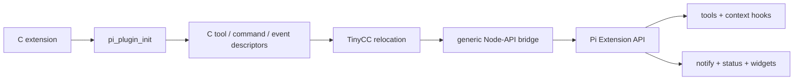

# pi-cplugins thesis

`pi-cplugins` makes C an implementation language for Pi extensions. The public
contract is `include/pi_plugin.h`, and its only entrypoint is
`pi_plugin_init`. A C extension can register Pi tools, commands, and named event
handlers; execute callbacks with cancellation and streaming updates; and drive
notifications, footer status, and widgets through the host table.

The TypeScript extension contains no per-plugin behavior. It is a generic
bridge from C registration descriptors to `pi.registerTool`,
`pi.registerCommand`, and `pi.on`. Tool and event payloads cross that bridge as
bounded JSON. C callback results become Pi tool results or event transforms,
including `before_agent_start`, `context`, `tool_call`, and `tool_result`
returns.

## One compiler owns calls and layout

Tree-sitter C derives binding metadata for ordinary non-static definitions.
That metadata generates the stable byte adapter, signature-specific typed
thunks, and the manifest. TinyCC compiles the user source and generated code in
one state. There is no second call engine.

Consequently, C owns its own ABI. TinyCC performs scalar calls, default
variadic promotions, callback signatures, by-value struct and union calls,
`sizeof`, `_Alignof`, and platform calling conventions. JavaScript converts
values at the boundary but does not maintain a parallel struct-layout or
calling-convention catalog.

Pointers accept buffers and typed views directly. Mutable arrays and strings
therefore retain native mutation semantics. Named structs and unions cross by
value as byte buffers whose size and alignment are queried from compiled C.
Synchronous JavaScript callbacks receive generated C trampolines; raw native
function pointers remain available when native code owns a longer lifetime.

## C-authored Pi behavior

Registration happens during `pi_plugin_init`. Descriptor strings and callback
pointers remain valid until close. A callback receives the Pi working directory
and an invocation handle. The saved host table uses that handle to poll
cancellation, emit partial tool results, notify the user, set footer status, or
set a widget.

Event names are strings rather than a frozen C enum. The bridge can therefore
carry Pi lifecycle and transform hooks without introducing numbered ABI types.
The callback input is the event JSON and its output is the normal Pi handler
result. A C handler can inject or replace a system prompt before an agent run,
replace context messages before a provider call, block a tool call, or transform
a tool result afterward.

`examples/pi_extension.c` is the observable proof. It registers a tool and a
slash command, installs `before_agent_start` and `tool_result` handlers, streams
a partial result, and updates notification, status, and widget UI. The README
runs it through a real non-interactive Pi agent.

## External libraries

TinyCC is the compiler and loader. `library` values go through
`tcc_add_library`; `flags` carries normal compiler options such as `-L` and
`-I`; `define` adds preprocessor definitions. Both `cc()` and the Pi-facing
`c_load` / `c_extension_load` tools expose those fields.

The external-library fixture builds `libanswer.a`, links
`examples/library_user.c` with `flags: "-L…"` and `library: "answer"`, and
executes the linked symbol. The README cell and runtime tests both run that
path.

## Lifetime and ownership

A compiled module owns its TinyCC state. Pi callbacks may enter relocated code
only while that state is alive. Session shutdown first invokes the plugin's
one-shot `close()` and then calls `tcc_delete`. C extension registrations are
not individually unloaded during a live session because Pi may retain their
callbacks; they close with the extension runtime.

The plugin copies the host table during initialization. Host allocation
callbacks free only host-domain allocations. Callback input, context, and output
are borrowed for the documented callback duration. N-API handles are
call-scoped. Pointer-backed JavaScript views remain owned by JavaScript unless a
separate native deallocator is explicitly attached.

## Execution boundary

Loading C executes native machine code in the Pi process with the same
operating-system permissions as Pi. Source-path containment prevents an agent
from loading a path outside the working directory; it is not source inspection
or a sandbox.

## Proof

The direct-linked C fixture exercises registration descriptors, a C tool
callback, allocator balance, reserved slots, bounded calls, and close semantics.
Node tests compile and invoke C-authored Pi tools, commands, before/after hooks,
TUI effects, scalar and pointer bindings, by-value aggregates, callbacks,
variadics, N-API values, and an external static library. `README.qmd` uses
`piknit`'s `pi` engine and knitr's `node` engine: `make readme` runs real Pi
agents for the linked zlib extension and SVG renderer plus the in-place Node
examples. The credential-free repository gate instead runs deterministic ABI,
runtime, package, and artifact tests. Linux and macOS CI run that gate;
macOS is the evidence for TinyCC relocation and flat-namespace behavior.
